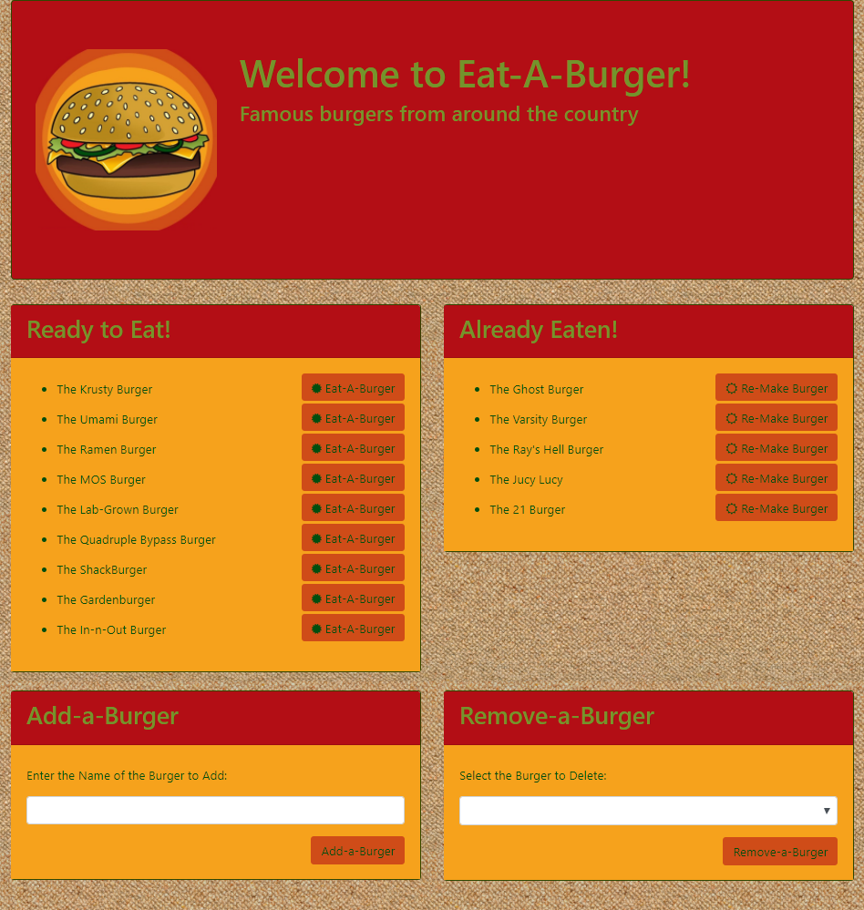

# Burger Bucket List

### Overview

This application stores a list of burgers the user(s) would like to eat. The application allows:
   * Mark burgers as eaten (and un-mark them as well)
   * Add new burgers to the list
   * Remove burgers from the list

[Demo Video](readme_media/burger_demo.mp4)

### Instructions

1. The application is located as follows:

   * Heroku deployment: [Burger Bucket List](https:https://burger-bucket-list.herokuapp.com/)

   * GitHub repository: [Burger Bucket List GitHub Repository](https://github.com/bpzimmerman/burger)

2. The application comes pre-loaded with some famous burgers organized into two fields.

3. Each Burger name is followed by a button allowing the user to move it to the `Already Eaten!` list or move it back to the `Ready to Eat!` list.

4. The form at the bottom left of the page allows the user to add a new burger to the database. The new burger will appear under the `Ready to Eat!` list. Please note that the application will not allow the user to submit a blank or all spaces Burger name.

5. The form at the bottom right of the page allows the user to delete a burger from the database. Please note that the application will not allow the user to submit a blank for the Burger to remove.